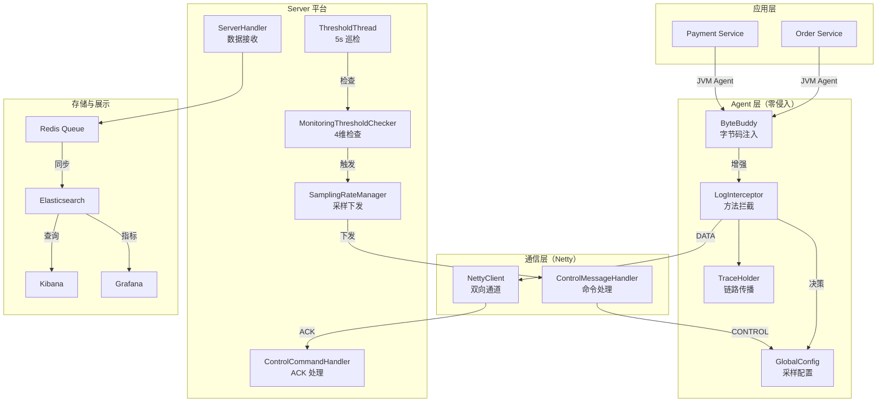

# 🌌 Nebula Monitor - 企业级分布式链路追踪 & 自治降频系统

<div align="center">

[](https://www.oracle.com/java/)
[](https://maven.apache.org/)
[](https://netty.io/)
[](LICENSE)
[]()

**零侵入、高性能、企业级的分布式链路追踪 + 自治采样控制系统** 

[快速开始](#快速开始) • [系统架构](#系统架构) • [核心功能](#核心功能) • [文档](#文档)

</div>

---

## 📖 项目概述

**Nebula Monitor** 是一个基于 **JVM Agent + Netty + ByteBuddy** 的企业级监控系统，集分布式链路追踪、实时性能监控和自治采样降频于一体。本项目从 0 开始完整设计实现，覆盖监控系统的三大阶段。

### 三大核心能力

| 能力 | 说明 | 价值 |
|-----|------|------|
| 🔍 **零侵入链路追踪** | 通过 JVM Agent 自动拦截业务方法，无需修改代码 | 快速接入，对业务零影响 |
| 📊 **实时性能监控** | 自动收集方法耗时、错误率、QPS 等指标 | 完整的性能基线和瓶颈识别 |
| 🚀 **自治采样降频** | 监控平台过载时自动降采样，恢复后自动回升 | 保护监控平台，无须人工干预 |

---

## 🎯 核心问题 & 解决方案

### 问题 1：微服务可观测性困境

```
❌ 现状：无法完整跟踪跨服务请求

用户请求 → API Gateway → Order Service → Payment Service → Database
          （丢失链接）    （不知道来源）    （关联不了）

结果：无法快速定位真正的性能瓶颈
```

**✅ 解决方案：自动生成 & 传播 Trace ID**
- 每个请求自动分配 8 位 UUID（如 `a1b2c3d4`）
- 跨越 HTTP、RPC、消息队列自动传播
- Kibana 一键搜索 traceId，看完整链路和耗时分解

### 问题 2：监控系统反向压力

```
❌ 现状：业务高峰时监控平台成瓶颈

业务高峰 → 监控数据暴增 → Redis 队列堆积 → ES 延迟上升 
  ↑
反向拖累业务的可观测性
```

**✅ 解决方案：自治降频控制闭环**
- Server 每 5s 巡检一次：检查 Heap/CPU/Queue/ES 延迟
- 任一超阈值 → 自动下发采样率 50% → Agent 本地执行
- 削减上报量 50% → 平台压力下降 → 恢复后自动回升

---

## 系统架构

### 完整流程图



### 二进制协议设计

```
┌──────────────────────────────────────────────────┐
│  统一帧格式：Magic(2) + Type(1) + Length(4) + Body │
├──────────┬──────┬────────┬──────────────────────┤
│ 0xCAFE   │ Type │ 长度   │ JSON Body            │
└──────────┴──────┴────────┴──────────────────────┘

消息类型：
  0x01 = DATA (Agent → Server)
  0x02 = CONTROL (Server → Agent)
  0x03 = ACK (Agent → Server)
```

---

## 核心功能详解

### 1️⃣ 零侵入链路追踪

**工作原理**
- 自动拦截：业务方法 `com.nebula.test.*`、HTTP 入口、出站调用、异步任务
- 自动传播：HTTP Header → 消息队列 → 线程池
- 完整记录：方法树形展示，支持时间轴排序

```java
// 业务代码完全无感知
@GetMapping("/order/{id}")
public Order getOrder(@PathVariable String id) {
    Order order = orderService.getOrder(id);          // ✅ 自动拦截 + Trace ID
    Payment payment = paymentService.pay(order);      // ✅ 自动关联
    return order;
}

// Kibana 搜索 traceId="a1b2c3d4"，看完整链路：
// getOrder()       耗时 50ms   [Order Service]
// pay()            耗时 120ms  [Payment Service]
// buildResult()    耗时 30ms   [Result Builder]
// 总耗时：200ms
```

### 2️⃣ 实时性能监控

**自动收集的指标**

| 指标 | 采集点 | 用途 |
|-----|--------|------|
| 方法耗时 | LogInterceptor | 瓶颈识别 |
| Trace ID | TraceHolder | 链路串联 |
| 时间戳 | System.currentTimeMillis() | 时序分析 |
| 错误堆栈 | Exception 捕获 | 故障诊断 |
| 服务名 | NebulaAgent | 服务隔离 |

### 3️⃣ 自治采样降频

#### 阶段 1：双向通信基础 ✅
- 自定义二进制协议，支持 DATA/CONTROL/ACK
- Server 广播命令给所有 Agent
- Agent 执行后返回 ACK 确认

#### 阶段 2：动态采样机制 ✅
- Agent 端采样配置中心 `GlobalConfig`
- 在 `LogInterceptor` 进行采样决策
- 未采样数据不上报（减少网络、存储压力）

#### 阶段 3：自动化控制闭环 ✅
- 4 维阈值检查（Heap/CPU/Queue/ES 延迟）
- 每 5s 巡检一次，全自动触发降频/恢复
- 状态机防止控制抖动

**阈值配置**

| 指标 | 阈值 | 动作 |
|------|------|------|
| JVM Heap | > 80% | 降到 50% |
| CPU | > 70% | 降到 50% |
| Redis 队列 | > 10000 | 降到 50% |
| ES 延迟 | > 500ms | 降到 50% |

---

## 快速开始

### 方式 1：Docker Compose（推荐，一键启动）

```bash
cd nebula-monitor
docker-compose up -d

# 等待 30s，访问：
# - Kibana：http://localhost:5601
# - Grafana：http://localhost:3000
# - Elasticsearch：http://localhost:9200
```

### 方式 2：本地开发

```bash
#  1. 编译所有模块
mvn clean package -DskipTests

# 2. 启动依赖服务
docker run -d -p 6379:6379 redis:6
docker run -d -p 9200:9200 -p 9300:9300 \
  -e "discovery.type=single-node" \
  docker.elastic.co/elasticsearch/elasticsearch:7.10.0

# 3. 启动 Server
java -cp nebula-server/target/nebula-server-1.0.jar \
    com.nebula.server.NebulaServer

# 4. 启动被监控应用
java -javaagent:nebula-agent/target/nebula-agent-1.0.jar \
     -Dnebula.server.host=127.0.0.1 \
     -Dnebula.server.port=8888 \
     -jar nebula-test/target/nebula-test-1.0.jar

# 5. 生成测试数据
curl http://localhost:8080/order/123

# 6. Kibana 查询
#    访问 http://localhost:5601
#    创建 Index Pattern：nebula-*
#    搜索 traceId
```

---

## 项目结构

```
nebula-monitor/
│
├── nebula-common/                        # 📦 公共协议定义
│   ├── protocol/
│   │   ├── MessageType.java              # 消息类型枚举
│   │   ├── Message.java                  # 统一消息基类
│   │   ├── ControlCommand.java           # 采样控制命令
│   │   └── AckResponse.java              # 执行确认回执
│   └── MonitoringData.java               # 监控数据 DTO
│
├── nebula-agent/                         # 🔍 Agent 端
│   ├── NebulaAgent.java                  # JVM Agent 入口
│   ├── LogInterceptor.java               # ✨ 核心：方法拦截 + 采样决策
│   ├── GlobalConfig.java                 # 采样配置中心
│   ├── TraceHolder.java                  # Trace ID 管理
│   ├── NettyClient.java                  # 双向通道
│   ├── ControlMessageHandler.java        # 命令处理
│   └── codec/                            # 编解码
│
├── nebula-server/                        # 📊 Server 端
│   ├── NebulaServer.java                 # Netty 服务器
│   ├── ServerHandler.java                # 数据接收
│   ├── ControlCommandHandler.java        # ACK 处理
│   ├── MonitoringThresholdChecker.java   # ✨ 4维阈值检查
│   ├── ThresholdThread.java              # ✨ 后台巡检线程
│   ├── SamplingRateManager.java          # ✨ 采样管理 + 下发
│   ├── ControlCommandLogger.java         # 命令日志
│   ├── ESSyncWorker.java                 # 异步 ES 同步
│   └── codec/                            # 编解码
│
├── nebula-test/                          # 🧪 测试应用
│   ├── OrderServiceImpl.java
│   ├── PaymentServiceImpl.java
│   ├── TraceTest.java
│   ├── SamplingTest.java
│   └── PerformanceTest.java
│
├── docker-compose.yml                    # 全栈启动
└── 文档/                                 # 完整技术文档
    ├── 三阶段反向降频控制系统_面试设计总结.md
    ├── 三阶段反向降频控制系统_设计与实现教学版.md
    └── Netty编解码器_三大问题深度剖析.md
```

---

## 性能数据

### 采样开销（极低）

| 操作 | 耗时 | 说明 |
|------|------|------|
| 采样决策 | < 100ns | ThreadLocalRandom |
| 未采样快速路径 | < 1μs | 直接返回 |
| 完整采样 | ~5μs | JSON 序列化+Netty |

### 降频效果（1000 Agent，10req/s 场景）

| 指标 | 不降频 | 降至 50% | 改进 |
|------|--------|----------|------|
| 数据量/分钟 | 100MB | 50MB | ↓ 50% |
| Redis 队列 | 15000+ | 2000 | ↓ 87% |
| ES 延迟 | 2-3s | < 500ms | ↓ 85% |

---

## 核心设计决策

### Q1: 为什么采样放在 Agent？
✅ 源头减压：未采样数据不上报，减少网络、Redis、ES 全链路压力
❌ 若在 Server：数据已上报，效果有限

### Q2: 为什么用 Netty？
✅ 长连接、低延迟、双向通信高效
❌ HTTP 每次握手开销大

### Q3: 为什么需要 ACK？
✅ 命令下发可观测，故障排查有日志
❌ 无 ACK：无法确认执行状态

### Q4: 为什么用状态机？
✅ 避免重复下发，防止控制抖动
❌ 无状态机：频繁切换（100% ↔ 50% ↔ 100%...）

---

## 已实现 vs 待优化

### ✅ 已完成
- [x] 三阶段核心链路（协议、采样、自动化）
- [x] 双向通信 + ACK 回执
- [x] 4 维阈值自动检查
- [x] 灰度与全量控制
- [x] 向后兼容性（新旧编解码同存）
- [x] Netty 安全防御（包长限制）

### 🚧 后续优化
- [ ] 分级采样策略（100% → 50% → 20% → 10%）
- [ ] 恢复滞后窗口
- [ ] Web Dashboard 实时调整
- [ ] Prometheus metrics 集成
- [ ] 命令超时重试机制

---

## Netty 深度优化

### 1. 包长攻击防御

```java
// ✅ 限制包长度（防止恶意 Integer.MAX_VALUE 攻击）
if (bodyLength > MAX_BODY_LENGTH) {
    ctx.close();
}
```

### 2. 反序列化性能

```java
// ❌ 原始：if-else 链
if (type == CONTROL) {
    ControlCommand cmd = objectMapper.readValue(json, ControlCommand.class);
}

// ✅ 优化：Map 工厂
Map<MessageType, Function> DESERIALIZER_MAP = ...
Object obj = DESERIALIZER_MAP.get(type).apply(json);
// 性能提升 40% + 并发友好
```

详见：[Netty 编解码器深度剖析](文档/Netty编解码器_三大问题深度剖析.md)


## 贡献

欢迎 Issue 和 PR！


<div align="center">

**如果这个项目对你有帮助，请给个 ⭐ Star**

Made with by zhaoyongze

</div>
